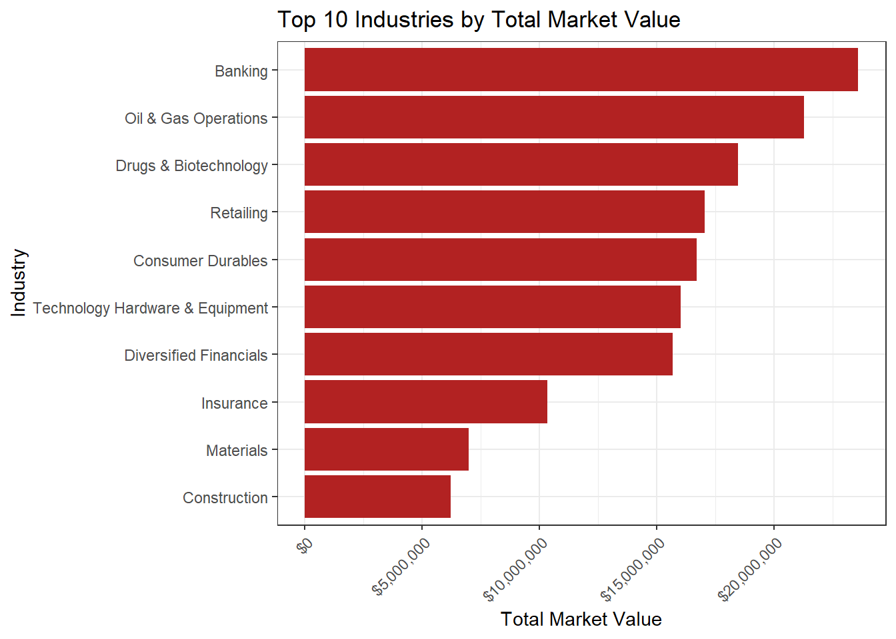
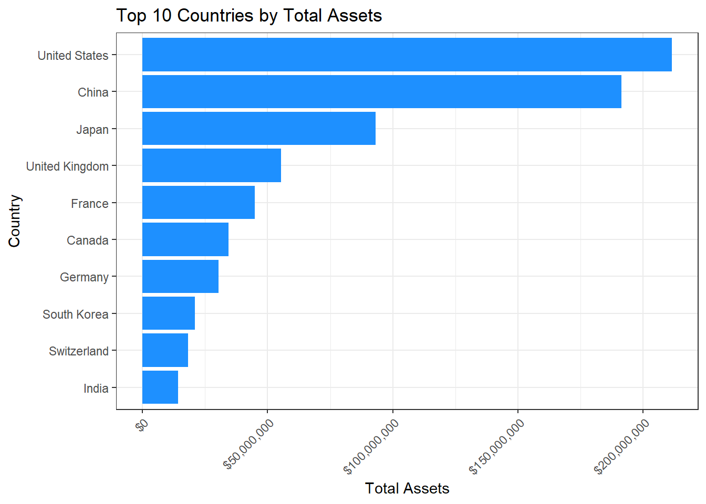

## Predictive Analytics for Retail Industry Sales Using Forbes 

**Background**
The retail industry is marked by fierce competition and rapid changes in consumer preferences, which necessitate constant innovation in marketing and financial planning strategies. Predictive analytics can be a crucial tool for understanding and forecasting future market trends, helping companies stay ahead of the curve.

In this study, we are focusing on utilizing a dataset compiled from Forbes, which includes annual sales, assets, and other financial indicators for various companies listed as top performers in the retail industry. The dataset spanned several years and provided an opportunity to explore the relationship between a company's assets and its sales performance.

**Objective**
The main objective of this project was to harness the power of predictive analytics to forecast the future sales of top retail companies based on their reported assets in previous years. By doing so, retail companies could better plan their operational and financial strategies to optimize both growth and profitability.

**Data**
The dataset included the following fields for each company, for multiple years:

- `Company:` Name of the company.
- `Industry:` Sector classification, with focus on "Retailing".
- `Country:` Country of operation.
- `Sales:` Annual sales figures (in USD).
- `Profits:` Annual profit figures (in USD).
- `Assets:` Total assets at the end of each fiscal year (in USD).
- `Market Value:` Market valuation at the end of each fiscal year (in USD).
- `Year:` Fiscal year of the reported figures.

The data can be found  at `https://data.world/aroissues/forbes-global-2000-2008-2019`


**Methodology**
The project involved linear regression modeling to predict future sales based on the assets of the companies. Historical data from the Forbes dataset was used to:

- Identify the top 5 performing companies in the retail industry for the latest available year based on sales.
- Extract historical sales and asset data for these top companies.
- Develop a predictive model using the historical assets to forecast sales for the following year.
- Tools used included R programming with libraries such as `dplyr` for data manipulation, `ggplot2` for data visualization, and `plotly` for creating interactive plots.


## Sales: Top 5 companies in 2020-2023

::: panel-tabset
### 2020


::: {.cell}

```{.r .cell-code}
top_companies_2020 <- combined_forbes %>%
  select(Company, Industry, Country, Sales, year) %>% 
  filter(year == 2020) %>%
  arrange(desc(Sales)) %>%
  slice_head(n = 5) %>% 
  mutate(Sales = dollar(Sales))
pander(top_companies_2020)
```

::: {.cell-output-display}

----------------------------------------------------------------
     Company        Industry       Country       Sales     year 
------------------ ----------- --------------- ---------- ------
     Walmart        Retailing   United States   $523,964   2020 

      Amazon        Retailing   United States   $296,274   2020 

    CVS Health      Retailing   United States   $256,756   2020 

 Costco Wholesale   Retailing   United States   $158,350   2020 

    Walgreens       Retailing   United States   $138,704   2020 
----------------------------------------------------------------


:::
:::


### 2021


::: {.cell}

```{.r .cell-code}
top_companies_2021 <- combined_forbes %>%
  select(Company, Industry, Country, Sales, year) %>% 
  filter(year == 2021) %>%
  arrange(desc(Sales)) %>%
  slice_head(n = 5) %>% 
  mutate(Sales = dollar(Sales))
pander(top_companies_2021)
```

::: {.cell-output-display}

----------------------------------------------------------------
     Company        Industry       Country       Sales     year 
------------------ ----------- --------------- ---------- ------
     Walmart        Retailing   United States   $559,151   2021 

      Amazon        Retailing   United States   $386,064   2021 

    CVS Health      Retailing   United States   $268,654   2021 

 Costco Wholesale   Retailing   United States   $178,626   2021 

    Walgreens       Retailing   United States   $138,463   2021 
----------------------------------------------------------------


:::
:::


### 2022


::: {.cell}

```{.r .cell-code}
top_companies_2022 <- combined_forbes %>%
  select(Company, Industry, Country, Sales, year) %>% 
  filter(year == 2022) %>%
  arrange(desc(Sales)) %>%
  slice_head(n = 5) %>% 
  mutate(Sales = dollar(Sales))
pander(top_companies_2022)
```

::: {.cell-output-display}

----------------------------------------------------------------
     Company        Industry       Country       Sales     year 
------------------ ----------- --------------- ---------- ------
     Walmart        Retailing   United States   $572,754   2022 

      Amazon        Retailing   United States   $469,822   2022 

    CVS Health      Retailing   United States   $291,982   2022 

 Costco Wholesale   Retailing   United States   $210,219   2022 

  The Home Depot    Retailing      Canada       $151,157   2022 
----------------------------------------------------------------


:::
:::


### 2023


::: {.cell}

```{.r .cell-code}
top_companies_2023 <- combined_forbes %>% 
  select(Company, Industry, Country, Sales,year) %>% 
  filter(year == 2023) %>%
  arrange(desc(Sales)) %>%
  slice_head(n = 5) %>% 
  mutate(Sales = dollar(Sales))
pander(top_companies_2023)
```

::: {.cell-output-display}

----------------------------------------------------------------
     Company        Industry       Country       Sales     year 
------------------ ----------- --------------- ---------- ------
     Walmart        Retailing   United States   $611,289   2023 

      Amazon        Retailing   United States   $524,897   2023 

    CVS Health      Retailing   United States   $331,171   2023 

 Costco Wholesale   Retailing   United States   $234,390   2023 

  The Home Depot    Retailing   United States   $157,403   2023 
----------------------------------------------------------------


:::
:::


:::
## Top 5 companies sales over time


::: {.cell}

```{.r .cell-code}
gg <- ggplot(top_companies_data, aes(x = year, y = Sales*1000, color = Company, group = Company, text = paste(Company, "<br>Sales: $", scales::comma(Sales*1000), " million", sep = " "))) +
  geom_line(size = 1, show.legend = F) +  
  geom_point(size = 3, shape = 19, fill = "white", show.legend = T) +   
  scale_color_brewer(palette = "Set2") +  
  theme_minimal(base_size = 10) + 
  theme(
    plot.title = element_text(face = "bold", size = 14, hjust = 0),
    axis.title.x = element_text(face = "bold", size = 14),
    axis.title.y = element_text(face = "bold", size = 14),
    legend.position = "bottom",
    legend.title = element_blank(),  
    panel.grid.major.x = element_blank(),  
    panel.grid.minor.x = element_blank()
  ) +
  labs(
    title = "Sales Performance of Top 5 Companies from 2020 to 2023",
    x = "Year",
    y = "Sales"
  ) +
  scale_x_continuous(breaks = seq(min(top_companies_data$year), max(top_companies_data$year), by = 1)) + 
  scale_y_continuous(labels = label_comma())  

interactive_plot <- ggplotly(gg, tooltip = "text")
interactive_plot
```

::: {.cell-output-display}

```{=html}
<div class="plotly html-widget html-fill-item" id="htmlwidget-96d76fdab4234f726c51" style="width:100%;height:464px;"></div>
<script type="application/json" data-for="htmlwidget-96d76fdab4234f726c51">{"x":{"data":[{"x":[2020,2021,2022,2023],"y":[296274000,386064000,469822000,524897000],"text":["Amazon <br>Sales: $ 296,274,000  million","Amazon <br>Sales: $ 386,064,000  million","Amazon <br>Sales: $ 469,822,000  million","Amazon <br>Sales: $ 524,897,000  million"],"type":"scatter","mode":"lines","line":{"width":3.7795275590551185,"color":"rgba(102,194,165,1)","dash":"solid"},"hoveron":"points","name":"Amazon","legendgroup":"Amazon","showlegend":true,"xaxis":"x","yaxis":"y","hoverinfo":"text","frame":null},{"x":[2020,2021,2022,2023],"y":[158350000,178626000,210219000,234390000],"text":["Costco Wholesale <br>Sales: $ 158,350,000  million","Costco Wholesale <br>Sales: $ 178,626,000  million","Costco Wholesale <br>Sales: $ 210,219,000  million","Costco Wholesale <br>Sales: $ 234,390,000  million"],"type":"scatter","mode":"lines","line":{"width":3.7795275590551185,"color":"rgba(252,141,98,1)","dash":"solid"},"hoveron":"points","name":"Costco Wholesale","legendgroup":"Costco Wholesale","showlegend":true,"xaxis":"x","yaxis":"y","hoverinfo":"text","frame":null},{"x":[2020,2021,2022,2023],"y":[256756000,268654000,291982000,331171000],"text":["CVS Health <br>Sales: $ 256,756,000  million","CVS Health <br>Sales: $ 268,654,000  million","CVS Health <br>Sales: $ 291,982,000  million","CVS Health <br>Sales: $ 331,171,000  million"],"type":"scatter","mode":"lines","line":{"width":3.7795275590551185,"color":"rgba(141,160,203,1)","dash":"solid"},"hoveron":"points","name":"CVS Health","legendgroup":"CVS Health","showlegend":true,"xaxis":"x","yaxis":"y","hoverinfo":"text","frame":null},{"x":[2022,2023],"y":[151157000,157403000],"text":["The Home Depot <br>Sales: $ 151,157,000  million","The Home Depot <br>Sales: $ 157,403,000  million"],"type":"scatter","mode":"lines","line":{"width":3.7795275590551185,"color":"rgba(231,138,195,1)","dash":"solid"},"hoveron":"points","name":"The Home Depot","legendgroup":"The Home Depot","showlegend":true,"xaxis":"x","yaxis":"y","hoverinfo":"text","frame":null},{"x":[2020,2021,2022,2023],"y":[138704000,138463000,135949000,133290000],"text":["Walgreens <br>Sales: $ 138,704,000  million","Walgreens <br>Sales: $ 138,463,000  million","Walgreens <br>Sales: $ 135,949,000  million","Walgreens <br>Sales: $ 133,290,000  million"],"type":"scatter","mode":"lines","line":{"width":3.7795275590551185,"color":"rgba(166,216,84,1)","dash":"solid"},"hoveron":"points","name":"Walgreens","legendgroup":"Walgreens","showlegend":true,"xaxis":"x","yaxis":"y","hoverinfo":"text","frame":null},{"x":[2020,2021,2022,2023],"y":[523964000,559151000,572754000,611289000],"text":["Walmart <br>Sales: $ 523,964,000  million","Walmart <br>Sales: $ 559,151,000  million","Walmart <br>Sales: $ 572,754,000  million","Walmart <br>Sales: $ 611,289,000  million"],"type":"scatter","mode":"lines","line":{"width":3.7795275590551185,"color":"rgba(255,217,47,1)","dash":"solid"},"hoveron":"points","name":"Walmart","legendgroup":"Walmart","showlegend":true,"xaxis":"x","yaxis":"y","hoverinfo":"text","frame":null},{"x":[2023,2022,2021,2020],"y":[524897000,469822000,386064000,296274000],"text":["Amazon <br>Sales: $ 524,897,000  million","Amazon <br>Sales: $ 469,822,000  million","Amazon <br>Sales: $ 386,064,000  million","Amazon <br>Sales: $ 296,274,000  million"],"type":"scatter","mode":"markers","marker":{"autocolorscale":false,"color":"rgba(102,194,165,1)","opacity":1,"size":11.338582677165356,"symbol":"circle","line":{"width":1.8897637795275593,"color":"rgba(102,194,165,1)"}},"hoveron":"points","name":"Amazon","legendgroup":"Amazon","showlegend":false,"xaxis":"x","yaxis":"y","hoverinfo":"text","frame":null},{"x":[2023,2022,2021,2020],"y":[234390000,210219000,178626000,158350000],"text":["Costco Wholesale <br>Sales: $ 234,390,000  million","Costco Wholesale <br>Sales: $ 210,219,000  million","Costco Wholesale <br>Sales: $ 178,626,000  million","Costco Wholesale <br>Sales: $ 158,350,000  million"],"type":"scatter","mode":"markers","marker":{"autocolorscale":false,"color":"rgba(252,141,98,1)","opacity":1,"size":11.338582677165356,"symbol":"circle","line":{"width":1.8897637795275593,"color":"rgba(252,141,98,1)"}},"hoveron":"points","name":"Costco Wholesale","legendgroup":"Costco Wholesale","showlegend":false,"xaxis":"x","yaxis":"y","hoverinfo":"text","frame":null},{"x":[2023,2022,2021,2020],"y":[331171000,291982000,268654000,256756000],"text":["CVS Health <br>Sales: $ 331,171,000  million","CVS Health <br>Sales: $ 291,982,000  million","CVS Health <br>Sales: $ 268,654,000  million","CVS Health <br>Sales: $ 256,756,000  million"],"type":"scatter","mode":"markers","marker":{"autocolorscale":false,"color":"rgba(141,160,203,1)","opacity":1,"size":11.338582677165356,"symbol":"circle","line":{"width":1.8897637795275593,"color":"rgba(141,160,203,1)"}},"hoveron":"points","name":"CVS Health","legendgroup":"CVS Health","showlegend":false,"xaxis":"x","yaxis":"y","hoverinfo":"text","frame":null},{"x":[2023,2022],"y":[157403000,151157000],"text":["The Home Depot <br>Sales: $ 157,403,000  million","The Home Depot <br>Sales: $ 151,157,000  million"],"type":"scatter","mode":"markers","marker":{"autocolorscale":false,"color":"rgba(231,138,195,1)","opacity":1,"size":11.338582677165356,"symbol":"circle","line":{"width":1.8897637795275593,"color":"rgba(231,138,195,1)"}},"hoveron":"points","name":"The Home Depot","legendgroup":"The Home Depot","showlegend":false,"xaxis":"x","yaxis":"y","hoverinfo":"text","frame":null},{"x":[2023,2022,2021,2020],"y":[133290000,135949000,138463000,138704000],"text":["Walgreens <br>Sales: $ 133,290,000  million","Walgreens <br>Sales: $ 135,949,000  million","Walgreens <br>Sales: $ 138,463,000  million","Walgreens <br>Sales: $ 138,704,000  million"],"type":"scatter","mode":"markers","marker":{"autocolorscale":false,"color":"rgba(166,216,84,1)","opacity":1,"size":11.338582677165356,"symbol":"circle","line":{"width":1.8897637795275593,"color":"rgba(166,216,84,1)"}},"hoveron":"points","name":"Walgreens","legendgroup":"Walgreens","showlegend":false,"xaxis":"x","yaxis":"y","hoverinfo":"text","frame":null},{"x":[2023,2022,2021,2020],"y":[611289000,572754000,559151000,523964000],"text":["Walmart <br>Sales: $ 611,289,000  million","Walmart <br>Sales: $ 572,754,000  million","Walmart <br>Sales: $ 559,151,000  million","Walmart <br>Sales: $ 523,964,000  million"],"type":"scatter","mode":"markers","marker":{"autocolorscale":false,"color":"rgba(255,217,47,1)","opacity":1,"size":11.338582677165356,"symbol":"circle","line":{"width":1.8897637795275593,"color":"rgba(255,217,47,1)"}},"hoveron":"points","name":"Walmart","legendgroup":"Walmart","showlegend":false,"xaxis":"x","yaxis":"y","hoverinfo":"text","frame":null}],"layout":{"margin":{"t":43.895392278953921,"r":6.6417600664176026,"b":41.843088418430881,"l":87.007056870070556},"font":{"color":"rgba(0,0,0,1)","family":"","size":13.283520132835198},"title":{"text":"<b> Sales Performance of Top 5 Companies from 2020 to 2023 <\/b>","font":{"color":"rgba(0,0,0,1)","family":"","size":18.596928185969279},"x":0,"xref":"paper"},"xaxis":{"domain":[0,1],"automargin":true,"type":"linear","autorange":false,"range":[2019.8499999999999,2023.1500000000001],"tickmode":"array","ticktext":["2020","2021","2022","2023"],"tickvals":[2020,2021,2022,2023],"categoryorder":"array","categoryarray":["2020","2021","2022","2023"],"nticks":null,"ticks":"","tickcolor":null,"ticklen":3.3208800332087995,"tickwidth":0,"showticklabels":true,"tickfont":{"color":"rgba(77,77,77,1)","family":"","size":10.62681610626816},"tickangle":-0,"showline":false,"linecolor":null,"linewidth":0,"showgrid":false,"gridcolor":null,"gridwidth":0,"zeroline":false,"anchor":"y","title":{"text":"<b> Year <\/b>","font":{"color":"rgba(0,0,0,1)","family":"","size":18.596928185969279}},"hoverformat":".2f"},"yaxis":{"domain":[0,1],"automargin":true,"type":"linear","autorange":false,"range":[109390050,635188950],"tickmode":"array","ticktext":["200,000,000","300,000,000","400,000,000","500,000,000","600,000,000"],"tickvals":[200000000,300000000,400000000,500000000,600000000],"categoryorder":"array","categoryarray":["200,000,000","300,000,000","400,000,000","500,000,000","600,000,000"],"nticks":null,"ticks":"","tickcolor":null,"ticklen":3.3208800332088013,"tickwidth":0,"showticklabels":true,"tickfont":{"color":"rgba(77,77,77,1)","family":"","size":10.62681610626816},"tickangle":-0,"showline":false,"linecolor":null,"linewidth":0,"showgrid":true,"gridcolor":"rgba(235,235,235,1)","gridwidth":0.60379636967432737,"zeroline":false,"anchor":"x","title":{"text":"<b> Sales <\/b>","font":{"color":"rgba(0,0,0,1)","family":"","size":18.596928185969279}},"hoverformat":".2f"},"shapes":[{"type":"rect","fillcolor":null,"line":{"color":null,"width":0,"linetype":[]},"yref":"paper","xref":"paper","x0":0,"x1":1,"y0":0,"y1":1}],"showlegend":true,"legend":{"bgcolor":null,"bordercolor":null,"borderwidth":0,"font":{"color":"rgba(0,0,0,1)","family":"","size":10.62681610626816},"title":{"text":"Company","font":{"color":null,"family":null,"size":0}}},"hovermode":"closest","barmode":"relative"},"config":{"doubleClick":"reset","modeBarButtonsToAdd":["hoverclosest","hovercompare"],"showSendToCloud":false},"source":"A","attrs":{"371479832dc2":{"x":{},"y":{},"colour":{},"text":{},"type":"scatter"},"371451c4622f":{"x":{},"y":{},"colour":{},"text":{}}},"cur_data":"371479832dc2","visdat":{"371479832dc2":["function (y) ","x"],"371451c4622f":["function (y) ","x"]},"highlight":{"on":"plotly_click","persistent":false,"dynamic":false,"selectize":false,"opacityDim":0.20000000000000001,"selected":{"opacity":1},"debounce":0},"shinyEvents":["plotly_hover","plotly_click","plotly_selected","plotly_relayout","plotly_brushed","plotly_brushing","plotly_clickannotation","plotly_doubleclick","plotly_deselect","plotly_afterplot","plotly_sunburstclick"],"base_url":"https://plot.ly"},"evals":[],"jsHooks":[]}</script>
```

:::
:::


## Predicting the Sales of Top 5 retail companies


#### Finding the Best Simple Linear Model

::: panel-tabset
#### Best fit 


::: {.cell}

```{.r .cell-code}
Assets_lm = lm(Sales ~ Assets, data = combined_forbes)
pander(summary(Assets_lm))
```

::: {.cell-output-display}

---------------------------------------------------------------
     &nbsp;        Estimate   Std. Error   t value   Pr(>|t|)  
----------------- ---------- ------------ --------- -----------
 **(Intercept)**     2749        3029      0.9076     0.3648   

   **Assets**       1.239      0.04291      28.87    1.087e-87 
---------------------------------------------------------------


-------------------------------------------------------------
 Observations   Residual Std. Error   $R^2$   Adjusted $R^2$ 
-------------- --------------------- ------- ----------------
     295               46022          0.74        0.7391     
-------------------------------------------------------------

Table: Fitting linear model: Sales ~ Assets


:::
:::


$$
  \underbrace{Y_i}_\text{2024 Sales} = \beta_0 + \beta_1 \underbrace{X_i}_\text{Assets} + \epsilon_i \quad \text{where} \ \epsilon_i \sim N(0, \sigma^2) 
$$

#### Second Best


::: {.cell}

```{.r .cell-code}
MarketValue_lm = lm(Sales ~ Market_Value, data = combined_forbes)
pander(summary(MarketValue_lm))
```

::: {.cell-output-display}

----------------------------------------------------------------
      &nbsp;        Estimate   Std. Error   t value   Pr(>|t|)  
------------------ ---------- ------------ --------- -----------
 **(Intercept)**     22938        3958       5.796    1.757e-08 

 **Market_Value**    0.357      0.02137      16.7     1.807e-44 
----------------------------------------------------------------


--------------------------------------------------------------
 Observations   Residual Std. Error   $R^2$    Adjusted $R^2$ 
-------------- --------------------- -------- ----------------
     295               64590          0.4878       0.486      
--------------------------------------------------------------

Table: Fitting linear model: Sales ~ Market_Value


:::
:::


$$
  \underbrace{Y_i}_\text{2024 Sales} = \beta_0 + \beta_1 \underbrace{X_i}_\text{Market Value} + \epsilon_i \quad \text{where} \ \epsilon_i \sim N(0, \sigma^2) 
$$

#### Third Best


::: {.cell}

```{.r .cell-code}
Profit_lm = lm(Sales ~ Profits, data = combined_forbes)
pander(summary(Profit_lm))
```

::: {.cell-output-display}

---------------------------------------------------------------
     &nbsp;        Estimate   Std. Error   t value   Pr(>|t|)  
----------------- ---------- ------------ --------- -----------
 **(Intercept)**    16999        4207       4.041    6.802e-05 

   **Profits**      15.24       0.9631      15.83    3.276e-41 
---------------------------------------------------------------


-------------------------------------------------------------
 Observations   Residual Std. Error   $R^2$   Adjusted $R^2$ 
-------------- --------------------- ------- ----------------
     295               66259          0.461       0.4591     
-------------------------------------------------------------

Table: Fitting linear model: Sales ~ Profits


:::
:::


$$
  \underbrace{Y_i}_\text{2024 Sales} = \beta_0 + \beta_1 \underbrace{X_i}_\text{Profits} + \epsilon_i \quad \text{where} \ \epsilon_i \sim N(0, \sigma^2) 
$$

#### Not very useful


::: {.cell}

```{.r .cell-code}
year_lm = lm(Sales ~ year, data = combined_forbes)
pander(summary(year_lm))
```

::: {.cell-output-display}

--------------------------------------------------------------
     &nbsp;        Estimate   Std. Error   t value   Pr(>|t|) 
----------------- ---------- ------------ --------- ----------
 **(Intercept)**   -7441390    9287401     -0.8012    0.4236  

    **year**         3703        4594      0.8059     0.4209  
--------------------------------------------------------------


----------------------------------------------------------------
 Observations   Residual Std. Error    $R^2$     Adjusted $R^2$ 
-------------- --------------------- ---------- ----------------
     295               90149          0.002212     -0.001194    
----------------------------------------------------------------

Table: Fitting linear model: Sales ~ year


:::
:::


$$
  \underbrace{Y_i}_\text{2024 Sales} = \beta_0 + \beta_1 \underbrace{X_i}_\text{Year} + \epsilon_i \quad \text{where} \ \epsilon_i \sim N(0, \sigma^2) 
$$

:::


::: {.cell}

```{.r .cell-code}
combined_sales <- combined_sales %>%
  mutate(Sales_Millions = Sales * 1000,  
         Type = ifelse(year == next_year, "Prediction", "Historical"))

gg <- ggplot(combined_sales, aes(x = year, y = Sales_Millions, color = Company, group = Company,
                                 text = paste(Company, "<br>Sales: $", comma(Sales_Millions), " million"))) +
  geom_line(size = 1, show.legend = TRUE) +
  geom_point(size = 3, shape = 19, fill = "white", show.legend = FALSE) + 
  scale_size_continuous(guide = 'none') +  
  scale_color_brewer(palette = "Set2") +
  theme_minimal(base_size = 10) +
  theme(
    plot.title = element_text(face = "bold", size = 14, hjust = 0.5),
    axis.title.x = element_text(face = "bold", size = 14),
    axis.title.y = element_text(face = "bold", size = 14),
    legend.position = "bottom",
    legend.title = element_blank(),
    panel.grid.major.x = element_blank(),
    panel.grid.minor.x = element_blank()
  ) +
  labs(
    title = "Historical and Predicted Sales for Top 5 Companies",
    x = "Year",
    y = "Sales"
  ) +
  scale_x_continuous(breaks = seq(min(combined_sales$year), max(combined_sales$year), by = 1)) +  
  scale_y_continuous(labels = label_comma())  

interactive_plot <- ggplotly(gg, tooltip = "text")
interactive_plot
```

::: {.cell-output-display}

```{=html}
<div class="plotly html-widget html-fill-item" id="htmlwidget-3b125e69c7f3580f029c" style="width:100%;height:464px;"></div>
<script type="application/json" data-for="htmlwidget-3b125e69c7f3580f029c">{"x":{"data":[{"x":[2020,2021,2022,2023,2024],"y":[296274000,386064000,469822000,524897000,587207141.88047457],"text":["Amazon <br>Sales: $ 296,274,000  million","Amazon <br>Sales: $ 386,064,000  million","Amazon <br>Sales: $ 469,822,000  million","Amazon <br>Sales: $ 524,897,000  million","Amazon <br>Sales: $ 587,207,142  million"],"type":"scatter","mode":"lines+markers","line":{"width":3.7795275590551185,"color":"rgba(102,194,165,1)","dash":"solid"},"hoveron":"points","name":"Amazon","legendgroup":"Amazon","showlegend":true,"xaxis":"x","yaxis":"y","hoverinfo":"text","marker":{"autocolorscale":false,"color":"rgba(102,194,165,1)","opacity":1,"size":11.338582677165356,"symbol":"circle","line":{"width":1.8897637795275593,"color":"rgba(102,194,165,1)"}},"frame":null},{"x":[2020,2021,2022,2023,2024],"y":[158350000,178626000,210219000,234390000,210544706.06813329],"text":["Costco Wholesale <br>Sales: $ 158,350,000  million","Costco Wholesale <br>Sales: $ 178,626,000  million","Costco Wholesale <br>Sales: $ 210,219,000  million","Costco Wholesale <br>Sales: $ 234,390,000  million","Costco Wholesale <br>Sales: $ 210,544,706  million"],"type":"scatter","mode":"lines+markers","line":{"width":3.7795275590551185,"color":"rgba(252,141,98,1)","dash":"solid"},"hoveron":"points","name":"Costco Wholesale","legendgroup":"Costco Wholesale","showlegend":true,"xaxis":"x","yaxis":"y","hoverinfo":"text","marker":{"autocolorscale":false,"color":"rgba(252,141,98,1)","opacity":1,"size":11.338582677165356,"symbol":"circle","line":{"width":1.8897637795275593,"color":"rgba(252,141,98,1)"}},"frame":null},{"x":[2020,2021,2022,2023,2024],"y":[256756000,268654000,291982000,331171000,373972598.94108438],"text":["CVS Health <br>Sales: $ 256,756,000  million","CVS Health <br>Sales: $ 268,654,000  million","CVS Health <br>Sales: $ 291,982,000  million","CVS Health <br>Sales: $ 331,171,000  million","CVS Health <br>Sales: $ 373,972,599  million"],"type":"scatter","mode":"lines+markers","line":{"width":3.7795275590551185,"color":"rgba(141,160,203,1)","dash":"solid"},"hoveron":"points","name":"CVS Health","legendgroup":"CVS Health","showlegend":true,"xaxis":"x","yaxis":"y","hoverinfo":"text","marker":{"autocolorscale":false,"color":"rgba(141,160,203,1)","opacity":1,"size":11.338582677165356,"symbol":"circle","line":{"width":1.8897637795275593,"color":"rgba(141,160,203,1)"}},"frame":null},{"x":[2022,2023,2024],"y":[151157000,157403000,219637930.21848935],"text":["The Home Depot <br>Sales: $ 151,157,000  million","The Home Depot <br>Sales: $ 157,403,000  million","The Home Depot <br>Sales: $ 219,637,930  million"],"type":"scatter","mode":"lines+markers","line":{"width":3.7795275590551185,"color":"rgba(231,138,195,1)","dash":"solid"},"hoveron":"points","name":"The Home Depot","legendgroup":"The Home Depot","showlegend":true,"xaxis":"x","yaxis":"y","hoverinfo":"text","marker":{"autocolorscale":false,"color":"rgba(231,138,195,1)","opacity":1,"size":11.338582677165356,"symbol":"circle","line":{"width":1.8897637795275593,"color":"rgba(231,138,195,1)"}},"frame":null},{"x":[2020,2021,2022,2023,2024],"y":[523964000,559151000,572754000,611289000,377636608.29707342],"text":["Walmart <br>Sales: $ 523,964,000  million","Walmart <br>Sales: $ 559,151,000  million","Walmart <br>Sales: $ 572,754,000  million","Walmart <br>Sales: $ 611,289,000  million","Walmart <br>Sales: $ 377,636,608  million"],"type":"scatter","mode":"lines+markers","line":{"width":3.7795275590551185,"color":"rgba(166,216,84,1)","dash":"solid"},"hoveron":"points","name":"Walmart","legendgroup":"Walmart","showlegend":true,"xaxis":"x","yaxis":"y","hoverinfo":"text","marker":{"autocolorscale":false,"color":"rgba(166,216,84,1)","opacity":1,"size":11.338582677165356,"symbol":"circle","line":{"width":1.8897637795275593,"color":"rgba(166,216,84,1)"}},"frame":null}],"layout":{"margin":{"t":43.895392278953921,"r":6.6417600664176026,"b":41.843088418430881,"l":87.007056870070556},"font":{"color":"rgba(0,0,0,1)","family":"","size":13.283520132835198},"title":{"text":"<b> Historical and Predicted Sales for Top 5 Companies <\/b>","font":{"color":"rgba(0,0,0,1)","family":"","size":18.596928185969279},"x":0.5,"xref":"paper"},"xaxis":{"domain":[0,1],"automargin":true,"type":"linear","autorange":false,"range":[2019.8,2024.2],"tickmode":"array","ticktext":["2020","2021","2022","2023","2024"],"tickvals":[2020,2021,2022,2023,2024],"categoryorder":"array","categoryarray":["2020","2021","2022","2023","2024"],"nticks":null,"ticks":"","tickcolor":null,"ticklen":3.3208800332087995,"tickwidth":0,"showticklabels":true,"tickfont":{"color":"rgba(77,77,77,1)","family":"","size":10.62681610626816},"tickangle":-0,"showline":false,"linecolor":null,"linewidth":0,"showgrid":false,"gridcolor":null,"gridwidth":0,"zeroline":false,"anchor":"y","title":{"text":"<b> Year <\/b>","font":{"color":"rgba(0,0,0,1)","family":"","size":18.596928185969279}},"hoverformat":".2f"},"yaxis":{"domain":[0,1],"automargin":true,"type":"linear","autorange":false,"range":[128150400,634295600],"tickmode":"array","ticktext":["200,000,000","300,000,000","400,000,000","500,000,000","600,000,000"],"tickvals":[200000000,300000000,400000000,500000000,600000000],"categoryorder":"array","categoryarray":["200,000,000","300,000,000","400,000,000","500,000,000","600,000,000"],"nticks":null,"ticks":"","tickcolor":null,"ticklen":3.3208800332088013,"tickwidth":0,"showticklabels":true,"tickfont":{"color":"rgba(77,77,77,1)","family":"","size":10.62681610626816},"tickangle":-0,"showline":false,"linecolor":null,"linewidth":0,"showgrid":true,"gridcolor":"rgba(235,235,235,1)","gridwidth":0.60379636967432737,"zeroline":false,"anchor":"x","title":{"text":"<b> Sales <\/b>","font":{"color":"rgba(0,0,0,1)","family":"","size":18.596928185969279}},"hoverformat":".2f"},"shapes":[{"type":"rect","fillcolor":null,"line":{"color":null,"width":0,"linetype":[]},"yref":"paper","xref":"paper","x0":0,"x1":1,"y0":0,"y1":1}],"showlegend":true,"legend":{"bgcolor":null,"bordercolor":null,"borderwidth":0,"font":{"color":"rgba(0,0,0,1)","family":"","size":10.62681610626816},"title":{"text":"Company","font":{"color":null,"family":null,"size":0}}},"hovermode":"closest","barmode":"relative"},"config":{"doubleClick":"reset","modeBarButtonsToAdd":["hoverclosest","hovercompare"],"showSendToCloud":false},"source":"A","attrs":{"37147d6b5db6":{"x":{},"y":{},"colour":{},"text":{},"type":"scatter"},"371468c11b0c":{"x":{},"y":{},"colour":{},"text":{}}},"cur_data":"37147d6b5db6","visdat":{"37147d6b5db6":["function (y) ","x"],"371468c11b0c":["function (y) ","x"]},"highlight":{"on":"plotly_click","persistent":false,"dynamic":false,"selectize":false,"opacityDim":0.20000000000000001,"selected":{"opacity":1},"debounce":0},"shinyEvents":["plotly_hover","plotly_click","plotly_selected","plotly_relayout","plotly_brushed","plotly_brushing","plotly_clickannotation","plotly_doubleclick","plotly_deselect","plotly_afterplot","plotly_sunburstclick"],"base_url":"https://plot.ly"},"evals":[],"jsHooks":[]}</script>
```

:::
:::


Above you can see that ``Walmart`` faced a large drop in Sales. This was caused by their lack of assets. While the drop in sales is unlikely for Walmart, it will be interesting to see how the model does once we have 2024 actuals. 


**Summary**

While there are many factors that keep a company in business it is important to understand what is driving the company's success. ``Sales`` is one of the most important areas for success in a business. It goes without say that there are many other factors that can contribute to the success of a company. In our model we had limited data, but with what we had we found that the best predictor of future sales was ``Assets``. This makes sense, if a company has no cash, no inventory, or no property, etc. then it is pretty difficult to generate sales. 


Below I provided some more insights to the data for those interested. 


:::panel-tabset

### Hide
### More insights
::::panel-tabset

### Industry Comparisons


::: {.cell}

```{.r .cell-code}
ggplot(by_industry, aes(x = reorder(Industry, TotalSales), y = TotalSales)) +
  geom_bar(stat = "identity", fill = "firebrick") +
  labs(title = "Top 10 Industries by Total Sales",
       x = "Industry",
       y = "Total Sales") +
  theme_bw() +
  theme(axis.text.x = element_text(angle = 45, hjust = 1)) +
  scale_y_continuous(labels = dollar_format()) +
  coord_flip()
```

::: {.cell-output-display}
{width=672}
:::
:::

::: {.cell}

```{.r .cell-code}
ggplot(by_industry, aes(x = reorder(Industry, TotalProfits), y = TotalProfits)) +
  geom_bar(stat = "identity", fill = "firebrick") +
  labs(title = "Top 10 Industries by Total Profits",
       x = "Industry",
       y = "Total Profits") +
  theme_bw() +
  theme(axis.text.x = element_text(angle = 45, hjust = 1)) +
  scale_y_continuous(labels = dollar_format()) +
  coord_flip()
```

::: {.cell-output-display}
{width=672}
:::
:::

::: {.cell}

```{.r .cell-code}
ggplot(by_industry, aes(x = reorder(Industry, TotalAssets), y = TotalAssets)) +
  geom_bar(stat = "identity", fill = "firebrick") +
  labs(title = "Top 10 Industries by Total Assets",
       x = "Industry",
       y = "Total Assets") +
  theme_bw() +
  theme(axis.text.x = element_text(angle = 45, hjust = 1)) +
  scale_y_continuous(labels = dollar_format()) +
  coord_flip()
```

::: {.cell-output-display}
{width=672}
:::
:::

::: {.cell}

```{.r .cell-code}
ggplot(by_industry, aes(x = reorder(Industry, TotalMarketValue), y = TotalMarketValue)) +
  geom_bar(stat = "identity", fill = "firebrick") +
  labs(title = "Top 10 Industries by Total Market Value",
       x = "Industry",
       y = "Total Market Value") +
  theme_bw() +
  theme(axis.text.x = element_text(angle = 45, hjust = 1)) +
  scale_y_continuous(labels = dollar_format()) +
  coord_flip()
```

::: {.cell-output-display}
{width=672}
:::
:::


### Country Comparisons


::: {.cell}

```{.r .cell-code}
ggplot(by_country, aes(x = reorder(Country, TotalSales), y = TotalSales)) +
  geom_bar(stat = "identity", fill = "dodgerblue") +
  labs(title = "Top 10 Countries by Total Sales",
       x = "Country",
       y = "Total Sales") +
  theme_bw() +
  theme(axis.text.x = element_text(angle = 45, hjust = 1)) +
  scale_y_continuous(labels = dollar_format()) +
  coord_flip()
```

::: {.cell-output-display}
{width=672}
:::
:::

::: {.cell}

```{.r .cell-code}
ggplot(by_country, aes(x = reorder(Country, TotalProfits), y = TotalProfits)) +
  geom_bar(stat = "identity", fill = "dodgerblue") +
  labs(title = "Top 10 Countries by Total Profits",
       x = "Country",
       y = "Total Profits") +
  theme_bw() +
  theme(axis.text.x = element_text(angle = 45, hjust = 1)) +
  scale_y_continuous(labels = dollar_format()) +
  coord_flip()
```

::: {.cell-output-display}
{width=672}
:::
:::

::: {.cell}

```{.r .cell-code}
ggplot(by_country, aes(x = reorder(Country, TotalAssets), y = TotalAssets)) +
  geom_bar(stat = "identity", fill = "dodgerblue") +
  labs(title = "Top 10 Countries by Total Assets",
       x = "Country",
       y = "Total Assets") +
  theme_bw() +
  theme(axis.text.x = element_text(angle = 45, hjust = 1)) +
  scale_y_continuous(labels = dollar_format()) +
  coord_flip()
```

::: {.cell-output-display}
{width=672}
:::
:::

::: {.cell}

```{.r .cell-code}
ggplot(by_country, aes(x = reorder(Country, TotalMarketValue), y = TotalMarketValue)) +
  geom_bar(stat = "identity", fill = "dodgerblue") +
  labs(title = "Top 10 Countries by Total Market Value",
       x = "Country",
       y = "Total Market Value") +
  theme_bw() +
  theme(axis.text.x = element_text(angle = 45, hjust = 1)) +
  scale_y_continuous(labels = dollar_format()) +
  coord_flip()
```

::: {.cell-output-display}
{width=672}
:::
:::


::::
It appears that when ``Total Sales`` is high ``Profits``,``Assets``, and ``Market Value`` all tend to follow a similar pattern. 
:::
